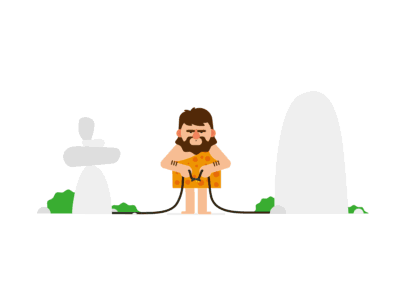

# ⚗️ Welcome to the Experimental LAB ⚡

  

  <b>🚀 Innovation | 💥 Risk | 🧪 Weird Science | 🤯 Genius in Disguise</b>

  
  
  

---

## 📊 Lab Activity Overview

<table align="center" border="0" cellpadding="10" cellspacing="0">
  <tr align="center">
    <td>
      
    </td>
    <td>
      
    </td>
    <td>
      
    </td>
  </tr>
  <tr align="center">
    <td>
      
    </td>
    <td>
      
    </td>
    <td>
       
    </td>
  </tr>
</table>
